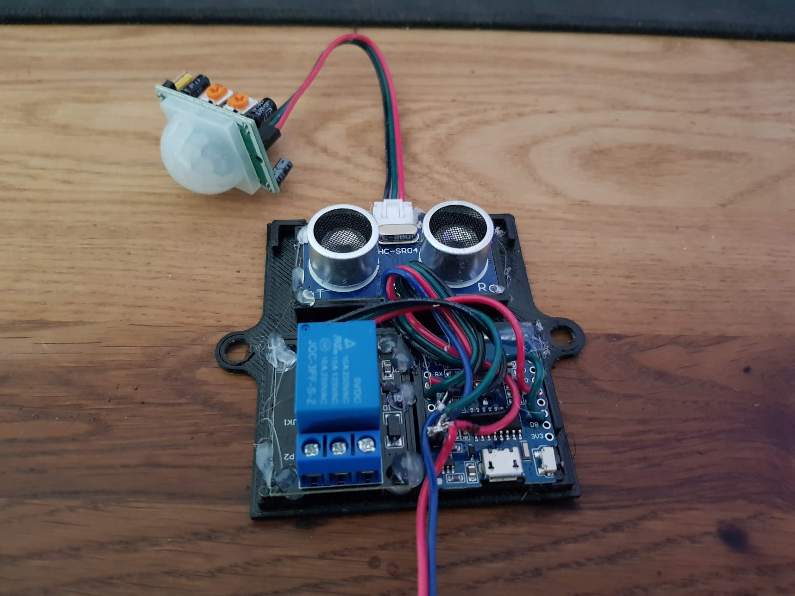
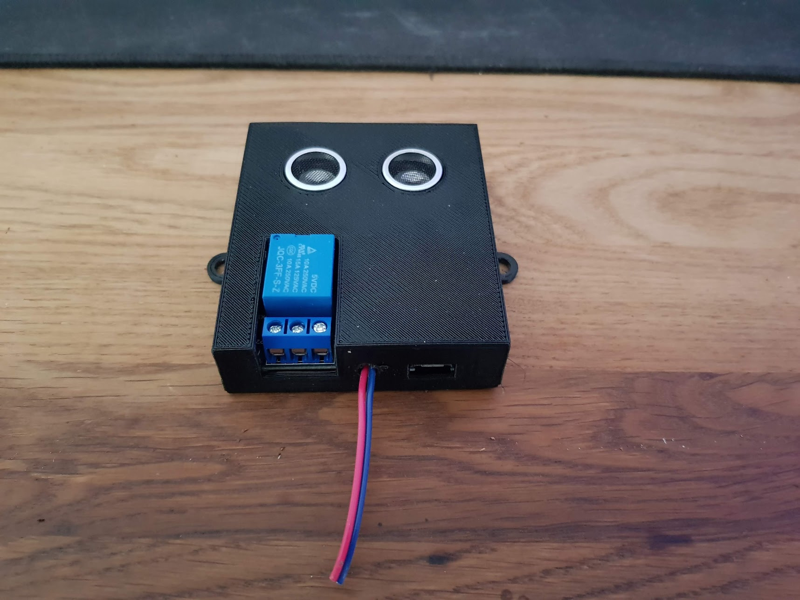
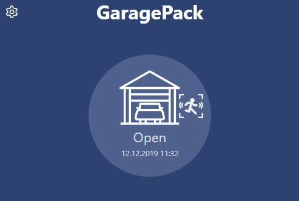
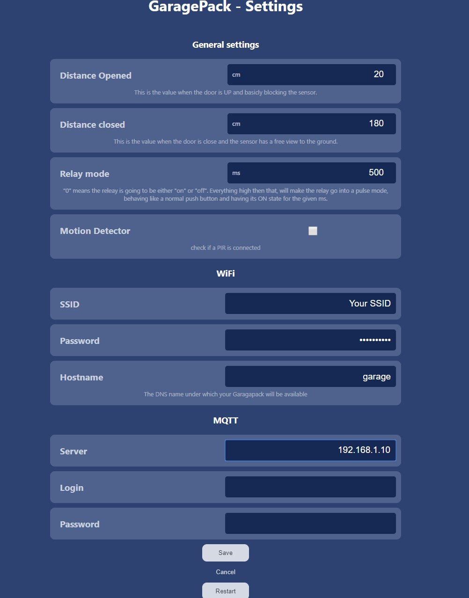

# GaragePack
This is the firmware for a Garagedoor Opener which can be controled via Web or MQTT.

Parts i used:
* Wemos D1 mini
* Relay (KY-019) 
* Ultrasonic sensor (HC-SR04)
* (optional) PIR sensor (HC-SR501)
* (optional) Printed case (check the docs folder for the files)


# Building
All of the necceassary part are powered from the Wemos so all you have to do is solder them correctly together. 
* The relay goes to D5, 5V and GND to the Wemos respectivly
* The Ultrasonicsensor also gets his 5V and GND, Echo to D2 and Pulse to D1
* (optional) PIR gets powered as usual and the data Signal goes to D7

(You can change/find all the Pins in the main.cpp if you want to.)





# Flashing the firmware and Setup
Once powered up, its time to flash the firmware. I recommend Platform IO (VScode) for that. Clone this repo and load it into PlatformIO.

* Click on the Platform IO button (Bee head in the left menu)
* Click "Update project Libraries" to make it download all neccassary libs
* click "Upload File System Image"
* click "Upload"

Thats pretty much it. If you click monitor now, you should be able to see some information in the terminal. The ESP should now start in Setup mode meaning you can connect to it via wifi.

* Search your available Wifi's for "GaragePackSetup" and connect to it
* once connected, open your Browser and connect to "http://192.168.4.1". the UI should now open
* click on the Cog symbol on the top right and enter your WIFI credentials, set a name Hostname and hit "save"
* the ESP should now do a reboot and should be available under "http://[hostname]"

# Usage

Test this before you mount it. The door (pulse) switch should go to the to right screw terminals. If you have a Toggle switch, you might need all 3 screw terminals.

Once tested, you need to mount it above your Garagedoor, so that the ultrasonic sensor is blocked, once the door is open.

## Web
Click the large icon and you should hear the relay trigger, thats pretty much it.

## MQTT
If you set a MQTT server, all state changes will be submitted to you MQTT server

**MQTT publish:** home/[hostname]/state
```
{"open":false,"car":false,"motion":false,"distance":296,"lastupdate":36645}
```
This is how a published message looks like


**MQTT commands:** home/[hostname]/cmnd
```
{command:"open", value:"On"}
```
You can send this command to this channel to open / close your door. NOTE: it wont matter if the value is "on" or "off", if the relay is set to pulse mode, the relay will trigger either way.


## Setup Mode
If you need to change the Wifi credentials and you are not able to change them using the UI, you can bring the Garapack back into Setupmode, by blocking the sensors, lower then 10cm for 10 seconds. If your closed garagedoor  is  closer then 10cm, you will need to change the "maxDistanceToConfig" in the main.cpp

## Wifi errors
If a Wifi connection is lost, the ESP will restart. if its still not able to connect, it will perform a reboot every 5 minutes until its able to connect.

## Firmware update
You can upload a new firmware remotely using this URL: **http://[yourhostname]/update**

Note: This will not overwrite your current settings.

## UI
I Like simplicity which is why the UI is pretty barebone and fully responsive.

Once you Open the web interface, you will be greeted by this screen. 



It shows you the current state of the Garagedoor and if movement is detected. A simple klick/touch on the Icon will trigger the relay and open / close the door, depending on its current state. The upper right icon will lead you to the Settings page

## Settings



## ToDo

* add MQTT port config
* remote update spiffs
* HomeASSISTANT autodetect (https://www.home-assistant.io/docs/mqtt/discovery/)


